```{js, echo=FALSE}
$( function() {
  /* Lets the user click on the images to view them in full resolution. */
  $( "img" ).wrap( function() {
    var link = $( '<a/>' );
    link.attr( 'href', $( this ).attr( 'src' ));
    link.attr( 'target', '_blank' );
    return link;
  } );
} );
```

```{r setup, echo=FALSE, error=TRUE, message=FALSE, warning=FALSE}
set.seed(2018)
if (file.exists("data/workspace.RData")) load("data/workspace.RData")

knitr::opts_chunk$set(
  error = TRUE, echo = FALSE, message = FALSE, warning = FALSE
)

library(magrittr)
```

```{r links, echo=FALSE, results='asis'}
cat('<p>{ <a href="https://phabricator.wikimedia.org/T204275">Phabricator Task</a> | <a href="https://github.com/wikimedia-research/Audiences-New_Readers-Hindi_Video_Campagin-April_2018">Analysis Codebase</a> }</p>')
```

# Background

The Wikimedia Foundation is working with Wikimedians across India to increase awareness of Wikipedia. Our goals are to improve recognition of Wikipedia and understanding of its uses.

About the program: https://docs.google.com/presentation/d/1lfgkp6jJyAuL1W8C3cBncNPpdskC8IpUxjL1Z-6NuYQ/edit?ts=5bc91e1d#slide=id.g2c34e0a974_0_299
Program page: https://meta.wikimedia.org/wiki/New_Readers/Raising_Awareness_in_India

On April 3 2018, we published and promoted the Ektara video on digital channels. The promotion was ran for 3 weeks and concluded on April 23.
On May 27 2018, the Ektara video broadcast on DD Sports during IPL Final.

# Data

In order to measure the traffic to Hindi Wikipedia, we chose the [pageviews](https://meta.wikimedia.org/wiki/Research:Page_view) and [unique devices](https://meta.wikimedia.org/wiki/Research:Unique_Devices) to Hindi Wikipedia as our test metrics. As the online video campaign was targeting the Madhya Pradesh region while the TV campaign was broadcast nationwide, the metrics we used were aggregated at the state and the country level respectively when analyzing the impact of these two channels [^1]. 

To reveal the impact of the video campaign on these metrics, we chose some control metrics as comparison. Specifically, for the online campaign, we compared the pageviews to Hindi Wikipedia from Madhya Pradesh with pageviews from other states in India, and with pageviews to other wikis [^2]; for the TV campaign, we compared the pageviews and unique devices to Hindi Wikipedia from India with pageviews and unique devices from other countries [^3], and with pageviews and unique devices to other wikis.

Since Google is the most popular search engine in India [^4], we also looked at the [Google trends](https://en.wikipedia.org/wiki/Google_Trends) [^5], and impressions and clicks counts of Hindi Wikipedia on Google (data was obtained from [Google search console](https://en.wikipedia.org/wiki/Google_Search_Console)).

[^1]: As of November 2018, we can't break down the unique devices counts by state.
[^2]: Top 10 wiki projects in India or Madhya Pradesh with the most pageviews and major Indian languages wikipedias spoken by more than 4% of the population (see [2011 census of India](#ref-5)).
[^3]: Top countries with most pageviews to Hindi Wikipedia, and countries whose official languages overlap with India (see the [list of languages by the number of countries in which they are recognized as an official language](https://en.wikipedia.org/wiki/List_of_languages_by_the_number_of_countries_in_which_they_are_recognized_as_an_official_language)).
[^4]: Search engine market share in India: http://gs.statcounter.com/search-engine-market-share/all/india
[^5]: We used the search terms: hindi wikipedia + wikipedia + विकिपीडिया + vikipeedyia

# Exploratory data analysis

## Online campaign

For the online campaign, there is a link to the Hindi Wikipedia main page under the video. After the promotion started on April 3rd, we saw some spikes in the main page pageviews from Madhya Pradesh on mobile platforms (mobile web or mobile app). External referred pageviews contribute the most to these spikes and they are users who clicked through the links most likely. There are also some spikes in direct pageviews, which means more users type in the URL or click on their bookmark to visit the main page during the campaign. We also noticed some smaller spikes in external referred pageviews from other states, which means the video was shared to users from other states in India.

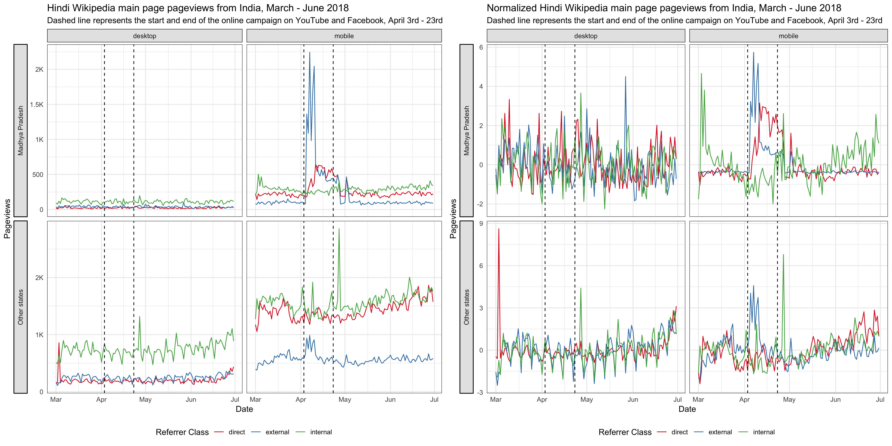

Since our goal is to improve recognition of Wikipedia and understanding of its uses, we care more about the overall pageviews to Hindi Wikipedia, not just the main page. Although the Hindi Wikipedia's pageviews from Madhya Pradesh has been increasing year-over-year, we didn't see any significant bumps during the online campaign. There seems to be a decrease during the period, but it's likely a seasonal trend. For the pageviews to other wikis and Google trends from Madhya Pradesh, we didn't see any increase during the online campaign period neither (see the [appendix][Graphs from exploratory data analysis]).

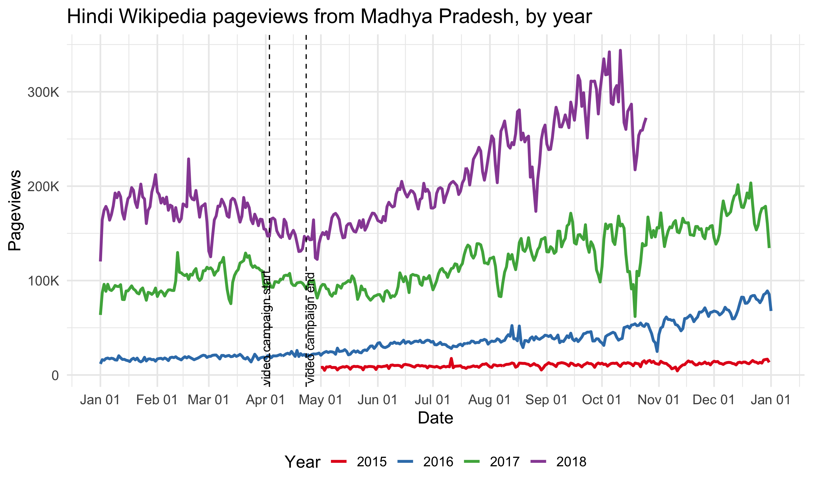

## TV campaign

Since the TV campaign was broadcast nationwide, we looked at the Hindi Wikipedia pageviews from the whole country. Although the pageviews has been increasing year-over-year, we didn't see any significant bumps on the day of the TV promotion. And the spike appeared several days after the promotion came from an internal referred traffic spike. Similarlly, we didn't see any bumps in the number of unique devices to Hindi Wikipedia from India on or after the day of the TV promotion. See the [appendix][Graphs from exploratory data analysis] for more breakdowns.

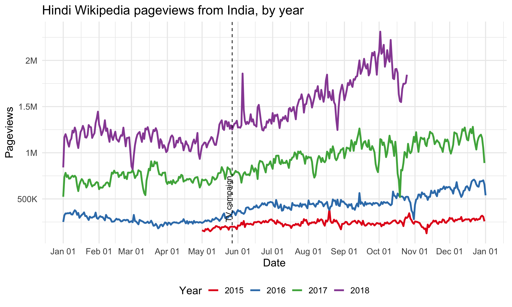

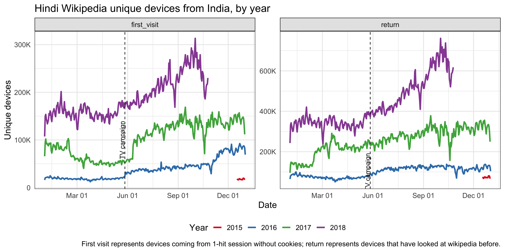

There's no significant bumps in Google search impressions and clicks to Hindi Wikipedia on or after the day of the TV promotion neither.

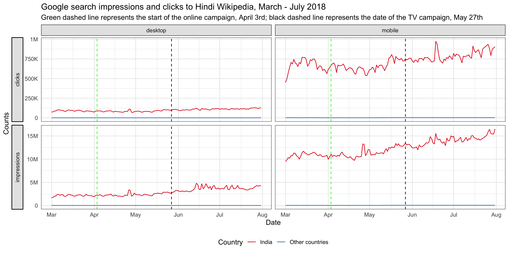

# Methods

In the last section, we didn't see any significant bumps in traffic after both campaigns, but it's possible that the campaign had some long term impact on the traffic to Hindi Wikipedia, e.g. the increase rate of the pageviews/unique devices changed. This kind of long term impact is what we care about most in this project -- to improve recognition of Wikipedia and the understanding of its uses.

In order to assess this hypothesis, we adopted an model-based approach to estimating the causal effect of a designed intervention on a time series. 
Given a response time series (e.g., clicks) and a set of control time series (e.g., clicks in non-affected markets or clicks on other sites), the package constructs a Bayesian structural time-series model. This model is then used to try and predict the counterfactual, i.e., how the response metric would have evolved after the intervention if the intervention had never occurred. We are assuming: there is a set control time series that were themselves not affected by the intervention; the relationship between covariates and treated time series, as established during the pre-period, remains stable throughout the post-period.

using the R package “bsts” (Scott et al., 2016).

Goal is to see if there is any effect in the next 60 days

check blog post and vignette for model description -- short!!

## Test and control series

for every y: the y are ...

for x: we exclude metrics from the same target area: No traffic to other wikis from India, since it's a multilingual country, the brand awareness will have effect on other wikis as well.

## Model tuning

don't mention I tune log: not proven to be helpful (should have revert back to original scale then compare)

## Validation

To prevent the model pick up spurious impact

To further confirm our conclusion, we also run other top models for each test series.

# Results

Try out other top models: is the results the same or not?

## Online campaign

Hindi Wikipedia pageviews:

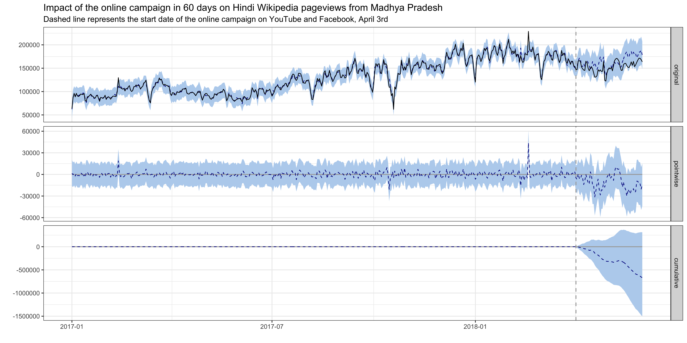

Hindi Wikipedia external referred pageviews:

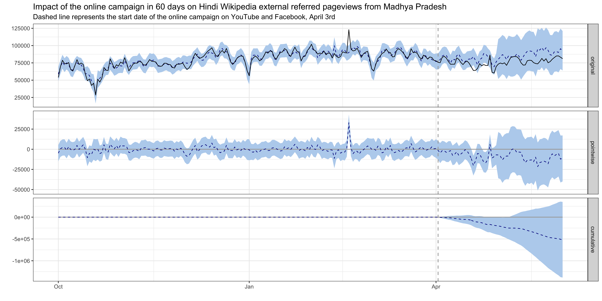

## TV campaign

Hindi Wikipedia pageviews:

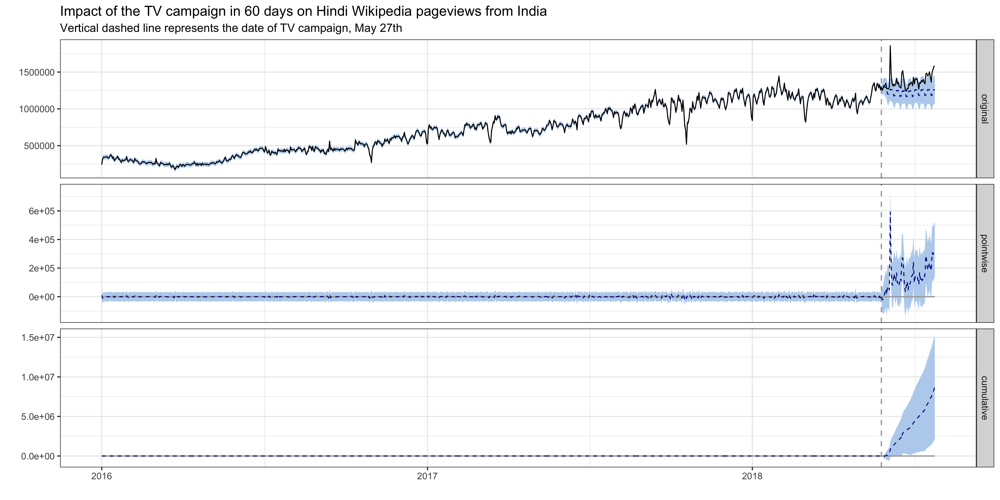

Hindi Wikipedia external referred pageviews:

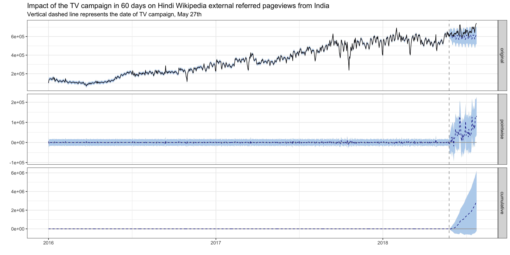

Hindi Wikipedia unique devices:

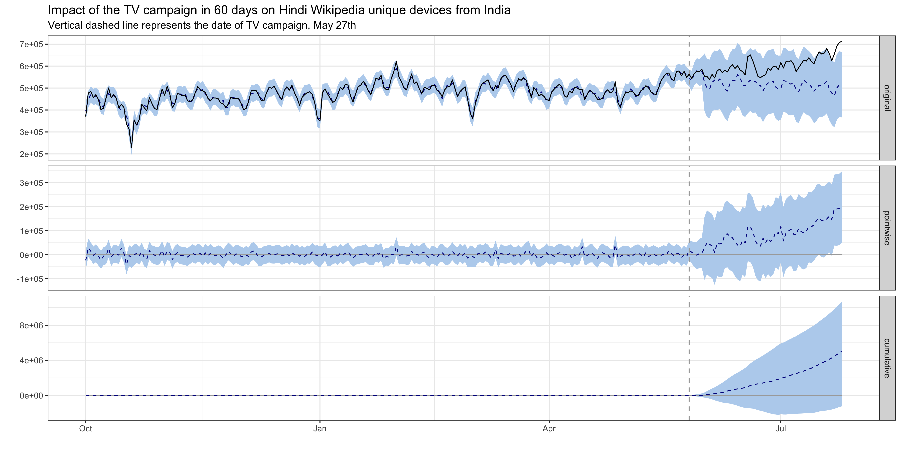

Hindi Wikipedia first visit unique devices:

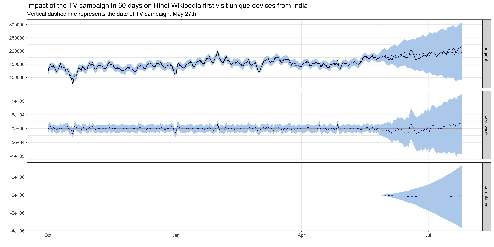

For TV campaign, control series are noisy, not significant result: companies are giving out cell phones in India -- we can't eliminate that effect (confounding effect) with our control series.

# Discussion

# Reference

## Reading

<ol>
<li id="ref-1">Scott, S. L., and Varian, H. R. (2014). Predicting the present with bayesian structural time series. International Journal of Mathematical Modelling and Numerical Optimisation, 5(1/2), 4. http://doi.org/10.1504/ijmmno.2014.059942</li>
<li id="ref-2">Brodersen, K. H., Gallusser, F., and Koehler, J. (2015). Inferring causal impact using Bayesian structural time-series models. The Annals of Applied Statistics. http://doi.org/10.1214/14-AOAS788, http://research.google.com/pubs/pub41854.html</li>
<li id="ref-3">Larsen, K. (2016, January 13). Making Causal Impact Analysis Easy [Blog post]. Retrieved from http://multithreaded.stitchfix.com/blog/2016/01/13/market-watch/</li>
<li id="ref-4">Larsen, K. (2016, April 21). Sorry ARIMA, but I’m Going Bayesian [Blog post]. Retrieved from http://multithreaded.stitchfix.com/blog/2016/04/21/forget-arima/</li>
<li id="ref-5">Census of India: Comparative speaker's strength of Scheduled Languages-1951, 1961, 1971, 1981, 1991, 2001 and 2011. http://www.censusindia.gov.in/2011Census/C-16_25062018_NEW.pdf</li>
</ol>

## Software

```{r packages_refs, results = 'asis'}
c("base", "bsts", "dtw", "CausalImpact", "magrittr", "ggplot2", "rmarkdown", "knitr") %>%
  lapply(function(pkg) { return(format(citation(package = pkg), "text")) }) %>%
  unlist %>%
  {
    paste0("<li id=\"ref-", (1:length(.)) + 4, "\">", ., "</li>")
  } %>%
  paste(collapse = "") %>%
  gsub("<URL:", "", ., fixed = TRUE) %>%
  gsub(">.", "", ., fixed = TRUE) %>%
  paste0("<ol start = \"5\" style = \"list-style-type: decimal\">", ., "</ol>", collapse = "") %>%
  gsub("\n", "", .) %>%
  cat
```

# Appendix

## Graphs from exploratory data analysis

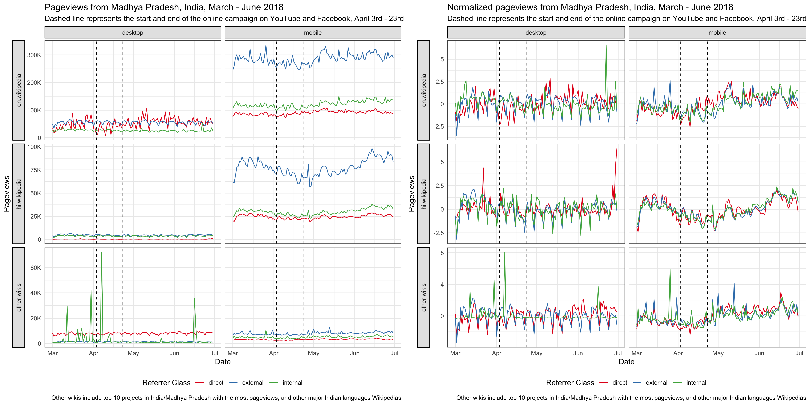

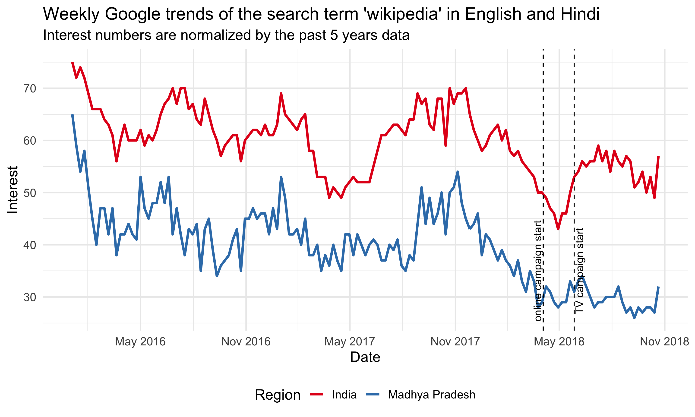

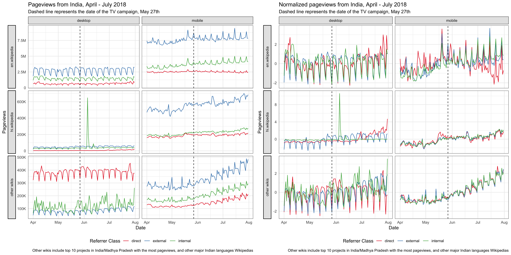

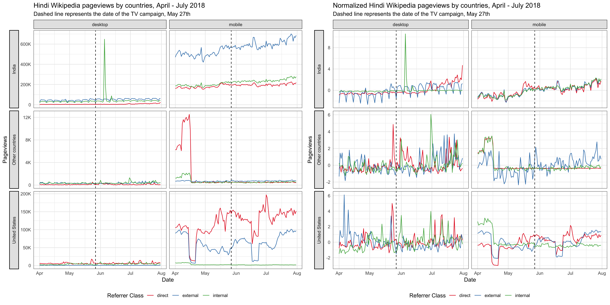

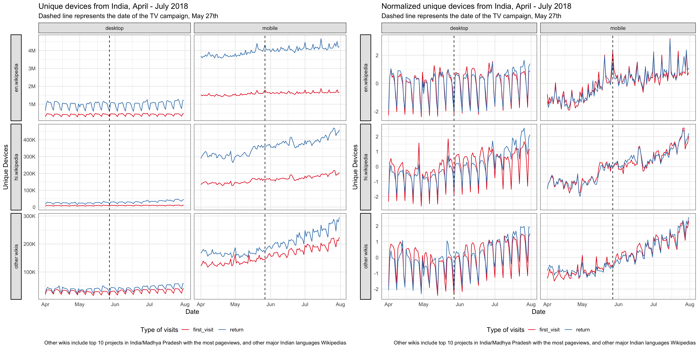

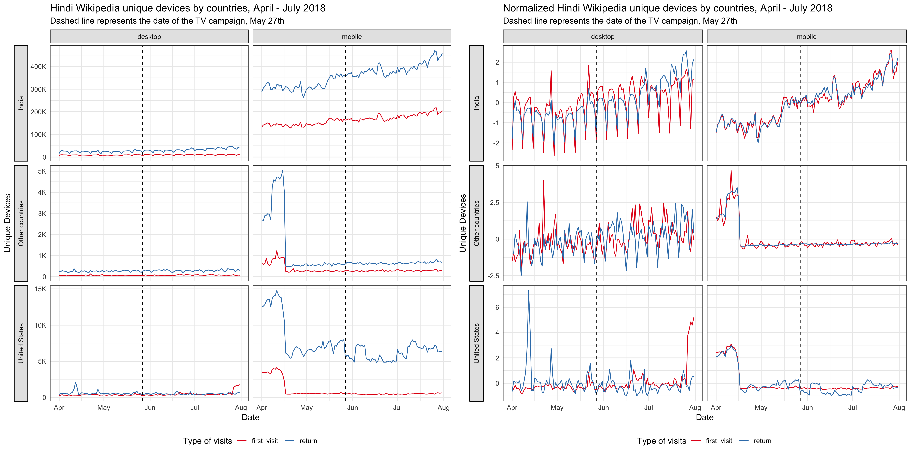

