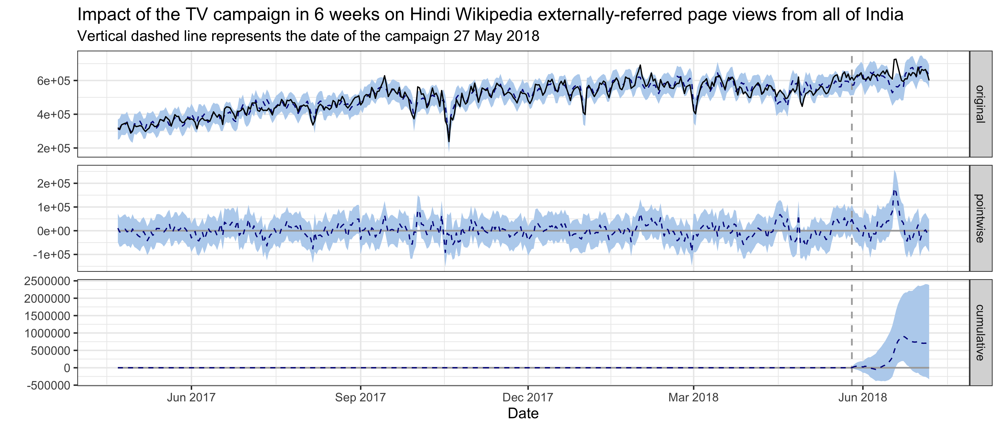
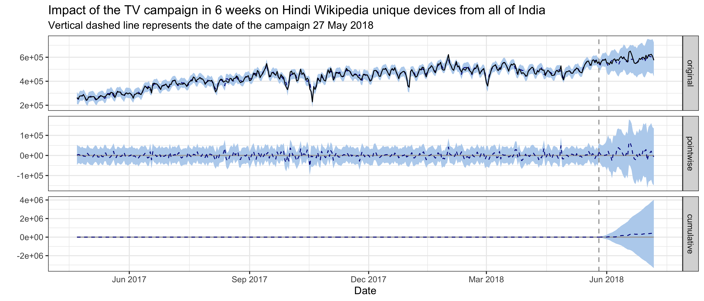

```{js, echo=FALSE}
$( function() {
  /* Lets the user click on the images to view them in full resolution. */
  $( "img" ).wrap( function() {
    var link = $( '<a/>' );
    link.attr( 'href', $( this ).attr( 'src' ));
    link.attr( 'target', '_blank' );
    return link;
  } );
} );
```

```{r setup, echo=FALSE, error=TRUE, message=FALSE, warning=FALSE}
set.seed(2018)
if (file.exists("data/workspace.RData")) load("data/workspace.RData")

knitr::opts_chunk$set(
  error = TRUE, echo = FALSE, message = FALSE, warning = FALSE
)

library(magrittr)
```

<h2>Executive Summary</h2>

To improve the recognition of Wikipedia and the understanding of its uses in India, the Wikimedia Foundation started a video campaign to explain and promote Hindi Wikipedia. On April 3 2018, we published and promoted the Ektara video on digital channels targeting Madhya Pradesh, which was live for 3 weeks. The online promotion resulted in ~1.2k clickthroughs/day on average during the campaign period. On May 27 2018, a second TV push happened during a major Cricket event.

In this analysis, we use Bayesian structural time series models to model Hindi Wikipedia pageviews and unique devices from Madhya Pradesh or India, and estimate the causal impact of the online and the TV campaign. The effect of the online campaign on pageviews from Madhya Pradesh is negative with its 95% credible interval included 0, meaning the online campaign did not have a statistically significant effect. The current model we are using on detecting the impact of the TV campaign on the overall pageviews from India is not very accurate according to our validation, although it indicates a statistically significantly positive impact -- 0.14M more pageviews daily with a 95% interval of [0.03M, 0.26M] in 60 days after the campaign. We didn't see significantly positive effect in the external referred pageviews, nor the unique devices count from India. Overall, we don't think the signal is strong enough to conclude that our campaign is a success.

<p style = "text-align: center;">
{ <a href="https://phabricator.wikimedia.org/T204275">Phabricator Task</a> | <a href="https://github.com/wikimedia-research/Audiences-New_Readers-Hindi_Video_Campaign-April_2018">Analysis Codebase</a> }
</p>

# Background

In India, only 33% of Hindi internet users have heard of Wikipedia. Meanwhile, internet access is growing 20%+ per year across India and Hindi online content consumption is growing 94% per year, but there are just 120,000 Wikipedia articles in Hindi and many users don’t know Hindi content is available. In July 2017, the Wikimedia Foundation and the Hindi Wikimedians User Group began collaborating to reach “New Readers” in India (see the [program page](https://meta.wikimedia.org/wiki/New_Readers/Raising_Awareness_in_India)). The goal is to increase awareness and drive new usage of Wikipedia among Hindi internet users.

To explain and promote Hindi Wikipedia, Wikimedia foundation started a video campaign in April 2018. On April 3 2018, we published and promoted the [Ektara video](https://commons.wikimedia.org/wiki/File:Wikipedia_-_Ektara_(English_subtitles).webm) on YouTube and Facebook targeting Hindi internet users in Madhya Pradesh who have not heard of Wikipedia. The online promotion ran for 3 weeks, then a second TV push happened during a major Cricket event (on DD Sports during IPL Final) on May 27 to the whole country. In this report, we analyze the impact of this video campaign on the traffic to Hindi Wikipedia and hope to establish a workflow of intervention analysis for other campaigns in the future.

# Data

In order to measure the traffic to Hindi Wikipedia, we chose the [pageviews](https://meta.wikimedia.org/wiki/Research:Page_view) and [unique devices](https://meta.wikimedia.org/wiki/Research:Unique_Devices) to Hindi Wikipedia as our test metrics. As the online video campaign was targeting the Madhya Pradesh region while the TV campaign was broadcast nationwide, the metrics we used were aggregated at the state and the country level respectively when analyzing the impact of these two channels [^1]. 

To reveal the impact of the video campaign on these metrics, we chose some control metrics as comparison. Specifically, for the online campaign, we compared the pageviews to Hindi Wikipedia from Madhya Pradesh with pageviews from other states in India, and with pageviews to other wikis [^2]; for the TV campaign, we compared the pageviews and unique devices to Hindi Wikipedia from India with pageviews and unique devices from other countries [^3], and with pageviews and unique devices to other wikis.

Since Google is the most popular search engine in India [^4], we also looked at the [Google trends](https://en.wikipedia.org/wiki/Google_Trends) [^5], and impressions and clicks counts of Hindi Wikipedia on Google (data was obtained from [Google search console](https://en.wikipedia.org/wiki/Google_Search_Console)).

[^1]: Because of our 90-days data retention policy, we cannot recover the webrequest data back in April and get the unique devices counts by state.
[^2]: Top 10 wiki projects in India or Madhya Pradesh with the most pageviews and major Indian languages wikipedias spoken by more than 4% of the population (see [2011 census of India](#ref-6)).
[^3]: Top countries with most pageviews to Hindi Wikipedia, and countries whose official languages overlap with India (see the [list of languages by the number of countries in which they are recognized as an official language](https://en.wikipedia.org/wiki/List_of_languages_by_the_number_of_countries_in_which_they_are_recognized_as_an_official_language)).
[^4]: Search engine market share in India: http://gs.statcounter.com/search-engine-market-share/all/india
[^5]: We used the search terms: hindi wikipedia + wikipedia + विकिपीडिया + vikipeedyia

# Exploratory data analysis

## Online campaign

For the online campaign, there is a link to the Hindi Wikipedia main page under the video. After the promotion started on April 3rd, we saw some spikes in the main page pageviews from Madhya Pradesh on mobile platforms (mobile web or mobile app). External referred pageviews contribute the most to these spikes and they are users who clicked through the links most likely. There are also some spikes in direct pageviews, which means more users type in the URL or click on their bookmark to visit the main page during the campaign. We also noticed some smaller spikes in external referred pageviews from other states, which means the video was shared to users from other states in India. According to [T185584](https://phabricator.wikimedia.org/T185584#4440086), the online campaign resulted in ~1.2k clickthroughs/day on average during the campaign period.


Since our goal is to improve recognition of Wikipedia and understanding of its uses, we care more about the overall pageviews to Hindi Wikipedia, not just the main page. Although the Hindi Wikipedia's pageviews from Madhya Pradesh has been increasing year-over-year, we didn't see any significant bumps during the online campaign. There seems to be a decrease during the period, but it's likely a seasonal trend. For the pageviews to other wikis and Google trends from Madhya Pradesh, we didn't see any increase during the online campaign period neither (see the [appendix][Graphs from exploratory data analysis]).


## TV campaign

Since the TV campaign was broadcast nationwide, we looked at the Hindi Wikipedia pageviews from the whole country. Although the pageviews has been increasing year-over-year, we didn't see any significant bumps on the day of the TV promotion. And the spike appeared several days after the promotion came from an internal referred traffic spike. Similarly, we didn't see any bumps in the number of unique devices to Hindi Wikipedia from India on or after the day of the TV promotion. See the [appendix][Graphs from exploratory data analysis] for more breakdowns.


There's no significant bumps in Google search impressions and clicks to Hindi Wikipedia on or after the day of the TV promotion neither.


# Methods

In the last section, we didn't see any significant bumps in traffic after both campaigns, but it's possible that the campaign had some long term impact on the traffic to Hindi Wikipedia, e.g. the increase rate of the pageviews/unique devices changed. This kind of long term impact is what we care about most in this project -- improving recognition of Wikipedia and the understanding of its uses.

In order to assess this hypothesis, we adopted an model-based approach to estimate the causal effect of the campaign on the pageviews and unique devices time series. With our test time series (pageviews and unique devices in Madhya Pradesh/India) as the response variable, and a set of control time series (pageviews and unique devices in non-affected regions) as predictors, we constructed a [Bayesian structural time series model](https://en.wikipedia.org/wiki/Bayesian_structural_time_series). This model was then used to predict the counterfactual, i.e., how the response metric would have evolved after the intervention if the intervention had never occurred. We then calculated the difference between the synthetic counterfactual control series and the observed test series for the post-intervention period (we chose 60 days in this analysis) – which is the estimated impact of the campaign – and compare to the posterior interval to gauge uncertainty. We used the R packages [“bsts”](https://CRAN.R-project.org/package=bsts) (Scott et al., 2018) and ["CausalImpact"](https://CRAN.R-project.org/package=CausalImpact) (Brodersen et al., 2017)[^6] for modeling and inference.

[^6]: We make some changes to the package to use it with our custom BSTS model. See https://github.com/chelsyx/CausalImpact .

## Test and control series

The approach we described above is based on the following assumptions:

* There is a set control time series that were themselves not affected by the intervention. If they were, we might falsely under- or overestimate the true effect. Or we might falsely conclude that there was an effect even though in reality there wasn't.
* The relationship between covariates and treated time series, as established during the pre-period, remains stable throughout the post-period.

Therefore, we chose these test and control series to analyze the online and TV campaign:

- **Online campaign**: We used the Hindi Wikipedia pageviews from Madhya Pradesh as the test series, and used Hindi Wikipedia pageviews from other India states and pageviews to other wikis [^2] from other India states as the control series. We excluded the pageviews to other wikis from Madhya Pradesh in the set of control series because most people in India are multilingual, if our brand awareness was affected by the campaign, the impact would likely be revealed on other wikis' traffic from the target region as well. We also analyzed a subset of the test and controls series -- the pageviews referred by search engines and external websites.
- **TV campaign**: We used the Hindi Wikipedia pageviews and unique devices from India as the test series, and used pageviews and unique devices from other countries [^3] to Hindi Wikipedia and other wikis as the control series. For the same reason mentioned above, we excluded the pageviews and unique devices to other wikis from India in the set of control series. We also analyzed a subset of the test and controls series -- the pageviews referred by search engines and external websites and the unique devices that visit our sites for the first time (without cookies).

Since there are hundreds of time series in the control sets, we want to prescreen them before fitting them into the models. Based on historical data prior to the intervention, we find the best control series for each test series using [dynamic time warping](https://en.wikipedia.org/wiki/Dynamic_time_warping) and correlation.

## Model selection

Before fitting bayesian structural time series model on the whole pre-intervention data set, we use [Hyndman’s evaluation on a rolling forecasting origin method](#ref-7) to perform cross validation for choosing the best model configuration. We used 10-fold cross validation with 7 days in each fold before the intervention, then compute and compare the [mean average percent error (MAPE)](https://en.wikipedia.org/wiki/Mean_absolute_percentage_error), [root mean square error (RMSE)](https://en.wikipedia.org/wiki/Root-mean-square_deviation) and [R squared](https://en.wikipedia.org/wiki/Coefficient_of_determination). To prevent the model from picking up spurious impact, we also computed the imaginary causal impact during validation period. We compared the estimated impact and its credible interval (the smaller the better), and we expected not to find a significant effect in the validation period, i.e., counterfactual estimates and actual data should agree reasonably closely.

We tried different combinations of the following model configuration:

- **Candidate control set**: 1) time series of Hindi Wikipedia, 2) a mixed of top 30 (among all control series) dynamic time warping-matched and correlated control series, 3) a mixed of top 10 (among all control series and among all Hindi Wikipedia series) dynamic time warping-matched and correlated control series, plus hand selected control series -- we selected states with more than 50% of their population speaking Hindi (see [2011 census of India](#ref-6)), 4) No control series.
- **Trend**: For the trend component, we tried 1) local level trend with prior standard deviation of the Gaussian random walk as 0.01, 2) local level trend with prior standard deviation of the Gaussian random walk as 0.1, 3) local linear trend, 4) semi-local linear trend, 5) a static intercept term.
- **AR component**: Whether to include an AR(1) state component.
- **Seasonality**: Whether to include a weekly and a monthly annual seasonality component.
- **Holiday**: Whether to include a regression-based holiday component. We considered Diwali, Raksha Bandhan, Holi, Dussehra and New year in this analysis.
- **Dynamic regression**: Whether to include time-varying regression coefficients.
- **Log transformation**:  Whether to use log transformed test and control series.
- **Training start date**: Since there might be different factors influencing the relationship between covariates and treated time series, we also tried changing the start date of our training data to 2016-01-01, 2017-01-01 and 2017-10-01.

Lastly, we plot the covariates to make sure they didn't affected by the real intervention.

# Results

We fit several top models for each test series and got very similar conclusions. In this section, we will present the best model for each test series according to our validation results.

## Online campaign

For Hindi Wikipedia pageviews from Madhya Pradesh, the best model has a static intercept, AR(1) and seasonality state component, but no holiday component. It uses a mixed of top 30 (among all control series) dynamic time warping-matched and correlated control series and the regression coefficients are static. The training data start from 2017-01-01 without log transformation.

In the plot below, the first panel shows the data and a counterfactual prediction for the post-intervention period. The second panel shows the difference between observed data and counterfactual predictions. This is the point-wise causal effect, as estimated by the model. The third panel adds up the point-wise contributions from the second panel, resulting in a plot of the cumulative effect of the intervention. The estimated causal effect is -11.15K pageviews daily with a 95% interval of [-25.03K, 5.20K], which means this effect is not statistically significant and may be the result of random fluctuations that are unrelated to the intervention.


For Hindi Wikipedia external referred pageviews from Madhya Pradesh, the best model has a static intercept, seasonality and holiday state component, but no AR(1) component. It uses a mixed of top 30 (among all control series) dynamic time warping-matched and correlated control series and the regression coefficients are static. The training data start from 2017-10-01 without log transformation. The estimated causal effect is -8.64K pageviews daily with a 95% interval of [-23.07K, 5.82K], which means this effect is not statistically significant and may be the result of random fluctuations that are unrelated to the intervention.


## TV campaign

### Pageviews

For Hindi Wikipedia pageviews from India, the best model has a local level trend with prior standard deviation of the Gaussian random walk as 0.01, and AR(1), seasonality and holiday state component. It didn't use any control series and the training data start from 2016-01-01 without log transformation. In fact, none of the top models use any control series according to our cross validation results, which may indicate the test series and the covariates are not correlated. Moreover, when testing the model on an imaginary intervention, the counterfactual estimates and actual data didn't agree closely, meaning that the causal impact we estimate below is not very trustworthy.

The estimated causal effect is 0.14M pageviews daily with a 95% interval of [0.03M, 0.26M], which means the positive effect observed during the intervention period is statistically significant.


For Hindi Wikipedia external referred pageviews from India, the best model has a local level trend with prior standard deviation of the Gaussian random walk as 0.01, and AR(1), seasonality and holiday state component. It didn't use any control series and the training data start from 2016-01-01 without log transformation. In fact, none of the top models use any control series according to our cross validation results, which may indicate the test series and the covariates are not correlated. Moreover, when testing the model on an imaginary intervention, the counterfactual estimates and actual data didn't agree closely, meaning that the causal impact we estimate below is not very trustworthy. 

The estimated causal effect is 49.77K pageviews daily with a 95% interval of [-3.66K, 103.71K], which means this effect is not statistically significant and may be the result of random fluctuations that are unrelated to the intervention.



### Unique Devices

For Hindi Wikipedia unique devices from India, the best model has a local level trend with prior standard deviation of the Gaussian random walk as 0.01, and AR(1), seasonality and holiday state component. It uses a mixed of top 10 (among all control series and among all Hindi Wikipedia series) dynamic time warping-matched and correlated control series and the regression coefficients are static. The training data start from 2017-10-01 without log transformation. The estimated causal effect is 84.11K unique devices daily with a 95% interval of [-20.54K, 178.52K], which means this effect is not statistically significant and may be the result of random fluctuations that are unrelated to the intervention.



For Hindi Wikipedia first visit unique devices from India, the best model has a local linear trend, but no AR(1), seasonality or holiday state component. It uses a mixed of top 10 (among all control series and among all Hindi Wikipedia series) dynamic time warping-matched and correlated control series and the regression coefficients are static. The training data start from 2017-10-01 without log transformation. The estimated causal effect is -0.96K unique devices daily with a 95% interval of [-60.98K, 55.03K], which means this effect is not statistically significant and may be the result of random fluctuations that are unrelated to the intervention.


# Discussion

There are some known issues in our data accuracy. First, the Wikimedia Foundation is using a paid IP geolocation databases [Maxmind](https://www.maxmind.com/en/geoip2-databases) to identify where our users coming from. It's known that the databases is not very reliable for anything below country-level (see [wikitech](https://wikitech.wikimedia.org/wiki/Analytics/Systems/Cluster/Geolocation) for more details) since 2014. Although MaxMind may have improved its accuracy since then, we are not sure at this moment. Second, [Google Web Light](https://support.google.com/webmasters/answer/6211428?hl=en), a service transcodes and hosts our pages on slow mobile connections, has been launched in India since 2015. It has lead to the inaccuracy in our pageviews and unique devices counts, and we will estimate its impact and fix this issue in our data in the future.

When training models using Hindi Wikipedia pageviews from India (see section [5.2.1][Pageviews]), we found that models with covariates are not better than the univariate time series models, and the univariate time series models are not very accurate according to our cross validation results. This may be the result of the confounding effect of India's increasing internet access -- telecom operators are in savage fight for market share and they have been giving out free cell phones with low cost data, which leads to a huge growth in internet access in India. Our covariates in this analysis didn't reflect the internet access growth probably and thus don't correlate with the test series very well before the intervention. Further research is needed to find other correlated covariates.

Since bayesian structural time series models are very computationally expensive, we didn't tune all the hyperparameters exhaustively (e.g. prior standard deviation, training start date). In the future, we should consider implementing bayesian hyperparameter optimization to select the best model more effectively. Additionally, as the real-life time series are not stationary while many of them also contain structural changes, an ensemble model is more robust and may minimizes the chance of any catastrophically bad forecast[^7].

Lastly, althought more thorough research is needed, we have seen companies conducting intervention experiment in a longer period and involving more regions/populations [^8]. For example, we can rank the regions by pageviews, then pairs of regions are randomly assigned to treatment and control groups. We expect that when multiple regions are assign to receive treatment, the random noise in the metrics would be mitigated.

[^7]: Our quest for robust time series forecasting at scale [Blog post]. https://www.unofficialgoogledatascience.com/2017/04/our-quest-for-robust-time-series.html
[^8]: Vaver, J. and Koehler, J. (2011). Measuring ad effectiveness using geo experiments. Technical report, Google Inc.

# Reference

## Reading

<ol>
<li id="ref-1">Scott, S. L., and Varian, H. R. (2014). Predicting the present with bayesian structural time series. International Journal of Mathematical Modelling and Numerical Optimisation, 5(1/2), 4. http://doi.org/10.1504/ijmmno.2014.059942</li>
<li id="ref-2">Brodersen, K. H., Gallusser, F., and Koehler, J. (2015). Inferring causal impact using Bayesian structural time-series models. The Annals of Applied Statistics. http://doi.org/10.1214/14-AOAS788, http://research.google.com/pubs/pub41854.html</li>
<li id="ref-3">Larsen, K. (2016, January 13). Making Causal Impact Analysis Easy [Blog post]. Retrieved from http://multithreaded.stitchfix.com/blog/2016/01/13/market-watch/</li>
<li id="ref-4">Larsen, K. (2016, April 21). Sorry ARIMA, but I’m Going Bayesian [Blog post]. Retrieved from http://multithreaded.stitchfix.com/blog/2016/04/21/forget-arima/</li>
<li id="ref-5">Scott, S. L. (2017, July 11). Fitting Bayesian structural time series with the bsts R package [Blog post]. Retrieved from http://www.unofficialgoogledatascience.com/2017/07/fitting-bayesian-structural-time-series.html</li>
<li id="ref-6">Census of India: Comparative speaker's strength of Scheduled Languages-1951, 1961, 1971, 1981, 1991, 2001 and 2011. http://www.censusindia.gov.in/2011Census/C-16_25062018_NEW.pdf</li>
<li id="ref-7">Hyndman, R. J. and G. Athanasopoulos (2012). Forecasting: principles and practice. OTexts. https://otexts.org/fpp2/accuracy.html</li>
</ol>

## Software

```{r packages_refs, results = 'asis'}
c("base", "bsts", "dtw", "CausalImpact", "ggplot2", "rmarkdown", "knitr") %>%
  lapply(function(pkg) { return(format(citation(package = pkg), "text")) }) %>%
  unlist %>%
  {
    paste0("<li id=\"ref-", (1:length(.)) + 7, "\">", ., "</li>")
  } %>%
  paste(collapse = "") %>%
  gsub("<URL:", "", ., fixed = TRUE) %>%
  gsub(">.", "", ., fixed = TRUE) %>%
  paste0("<ol start = \"8\" style = \"list-style-type: decimal\">", ., "</ol>", collapse = "") %>%
  gsub("\n", "", .) %>%
  cat
```

# Appendix

## Graphs from exploratory data analysis


