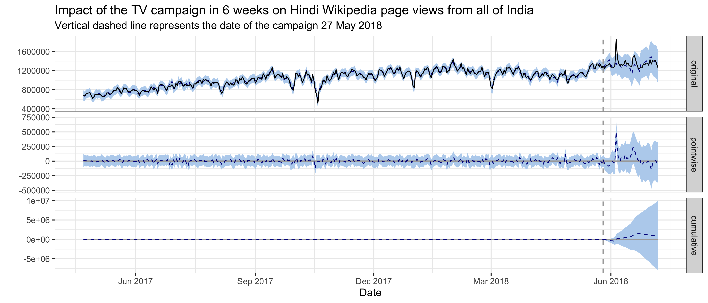

```{js, echo=FALSE}
$( function() {
  /* Lets the user click on the images to view them in full resolution. */
  $( "img" ).wrap( function() {
    var link = $( '<a/>' );
    link.attr( 'href', $( this ).attr( 'src' ));
    link.attr( 'target', '_blank' );
    return link;
  } );
} );
```

```{r setup, echo=FALSE, error=TRUE, message=FALSE, warning=FALSE}
set.seed(2018)
if (file.exists("data/workspace.RData")) load("data/workspace.RData")

knitr::opts_chunk$set(
  error = TRUE, echo = FALSE, message = FALSE, warning = FALSE
)

library(magrittr)
```

<h2>Executive Summary</h2>

In July 2017, the Wikimedia Foundation and the Hindi Wikimedians User Group began collaborating to reach “New Readers” in India. On April 3 2018, we published and promoted the Ektara video on digital channels targeting Madhya Pradesh. The promotion was ran for 3 weeks and concluded on April 23. On May 27 2018, the Ektara video broadcast on DD Sports during IPL Final. Our goals are to improve recognition of Wikipedia and understanding of its uses.

In this analysis, we use Bayesian structural time series models to model Hindi Wikipedia pageviews and unique devices from Madhya Pradesh or India, and estimate the causal impact of the online and the TV campaign. The effect of the online campaign on pageviews from Madhya Pradesh is negative with its 95% credible interval included 0, meaning the online campaign did not have a statistically significant effect. The effect of the TV campaign on the overall pageviews from India is statistically significantly positive -- 0.14M more pageviews daily with a 95% interval of [0.04M, 0.26M] in 60 days after the campaign. However, we didn't see significantly positive effect in the external referred pageviews, nor the unique devices count from India. Overall, we don't think the signal is strong enough to conclude that our campaign is a success.

<p style = "text-align: center;">
{ <a href="https://phabricator.wikimedia.org/T204275">Phabricator Task</a> | <a href="https://github.com/wikimedia-research/Audiences-New_Readers-Hindi_Video_Campagin-April_2018">Analysis Codebase</a> }
</p>

# Background

The Wikimedia Foundation is working with Wikimedians across India to increase awareness of Wikipedia. Our goals are to improve recognition of Wikipedia and understanding of its uses.

<!-- About the program: https://docs.google.com/presentation/d/1lfgkp6jJyAuL1W8C3cBncNPpdskC8IpUxjL1Z-6NuYQ/edit?ts=5bc91e1d#slide=id.g2c34e0a974_0_299 -->
<!-- Program page: https://meta.wikimedia.org/wiki/New_Readers/Raising_Awareness_in_India -->

On April 3 2018, we published and promoted the Ektara video on digital channels. The promotion was ran for 3 weeks and concluded on April 23.
On May 27 2018, the Ektara video broadcast on DD Sports during IPL Final.

# Data

In order to measure the traffic to Hindi Wikipedia, we chose the [pageviews](https://meta.wikimedia.org/wiki/Research:Page_view) and [unique devices](https://meta.wikimedia.org/wiki/Research:Unique_Devices) to Hindi Wikipedia as our test metrics. As the online video campaign was targeting the Madhya Pradesh region while the TV campaign was broadcast nationwide, the metrics we used were aggregated at the state and the country level respectively when analyzing the impact of these two channels [^1]. 

To reveal the impact of the video campaign on these metrics, we chose some control metrics as comparison. Specifically, for the online campaign, we compared the pageviews to Hindi Wikipedia from Madhya Pradesh with pageviews from other states in India, and with pageviews to other wikis [^2]; for the TV campaign, we compared the pageviews and unique devices to Hindi Wikipedia from India with pageviews and unique devices from other countries [^3], and with pageviews and unique devices to other wikis.

Since Google is the most popular search engine in India [^4], we also looked at the [Google trends](https://en.wikipedia.org/wiki/Google_Trends) [^5], and impressions and clicks counts of Hindi Wikipedia on Google (data was obtained from [Google search console](https://en.wikipedia.org/wiki/Google_Search_Console)).

[^1]: As of November 2018, we can't break down the unique devices counts by state.
[^2]: Top 10 wiki projects in India or Madhya Pradesh with the most pageviews and major Indian languages wikipedias spoken by more than 4% of the population (see [2011 census of India](#ref-5)).
[^3]: Top countries with most pageviews to Hindi Wikipedia, and countries whose official languages overlap with India (see the [list of languages by the number of countries in which they are recognized as an official language](https://en.wikipedia.org/wiki/List_of_languages_by_the_number_of_countries_in_which_they_are_recognized_as_an_official_language)).
[^4]: Search engine market share in India: http://gs.statcounter.com/search-engine-market-share/all/india
[^5]: We used the search terms: hindi wikipedia + wikipedia + विकिपीडिया + vikipeedyia

# Exploratory data analysis

## Online campaign

For the online campaign, there is a link to the Hindi Wikipedia main page under the video. After the promotion started on April 3rd, we saw some spikes in the main page pageviews from Madhya Pradesh on mobile platforms (mobile web or mobile app). External referred pageviews contribute the most to these spikes and they are users who clicked through the links most likely. There are also some spikes in direct pageviews, which means more users type in the URL or click on their bookmark to visit the main page during the campaign. We also noticed some smaller spikes in external referred pageviews from other states, which means the video was shared to users from other states in India.


Since our goal is to improve recognition of Wikipedia and understanding of its uses, we care more about the overall pageviews to Hindi Wikipedia, not just the main page. Although the Hindi Wikipedia's pageviews from Madhya Pradesh has been increasing year-over-year, we didn't see any significant bumps during the online campaign. There seems to be a decrease during the period, but it's likely a seasonal trend. For the pageviews to other wikis and Google trends from Madhya Pradesh, we didn't see any increase during the online campaign period neither (see the [appendix][Graphs from exploratory data analysis]).


## TV campaign

Since the TV campaign was broadcast nationwide, we looked at the Hindi Wikipedia pageviews from the whole country. Although the pageviews has been increasing year-over-year, we didn't see any significant bumps on the day of the TV promotion. And the spike appeared several days after the promotion came from an internal referred traffic spike. Similarlly, we didn't see any bumps in the number of unique devices to Hindi Wikipedia from India on or after the day of the TV promotion. See the [appendix][Graphs from exploratory data analysis] for more breakdowns.


There's no significant bumps in Google search impressions and clicks to Hindi Wikipedia on or after the day of the TV promotion neither.


# Methods

In the last section, we didn't see any significant bumps in traffic after both campaigns, but it's possible that the campaign had some long term impact on the traffic to Hindi Wikipedia, e.g. the increase rate of the pageviews/unique devices changed. This kind of long term impact is what we care about most in this project -- improving recognition of Wikipedia and the understanding of its uses.

In order to assess this hypothesis, we adopted an model-based approach to estimate the causal effect of the campaign on the pageviews and unique devices time series. With our test time series (pageviews and unique devices in Madhya Pradesh/India) as the response variable, and a set of control time series (pageviews and unique devices in non-affected regions) as predictors, we constructed a [Bayesian structural time series model](https://en.wikipedia.org/wiki/Bayesian_structural_time_series). This model was then used to predict the counterfactual, i.e., how the response metric would have evolved after the intervention if the intervention had never occurred. We then calculated the difference between the synthetic counterfactual control series and the observed test series for the post-intervention period (we chose 60 days in this analysis) – which is the estimated impact of the campaign – and compare to the posterior interval to gauge uncertainty. We used the R packages [“bsts”](https://CRAN.R-project.org/package=bsts) (Scott et al., 2018) and ["CausalImpact"](https://CRAN.R-project.org/package=CausalImpact) (Brodersen et al., 2017) for modeling and inference.

## Test and control series

The approach we described above is based on the following assumptions:

* There is a set control time series that were themselves not affected by the intervention. If they were, we might falsely under- or overestimate the true effect. Or we might falsely conclude that there was an effect even though in reality there wasn’t.
* The relationship between covariates and treated time series, as established during the pre-period, remains stable throughout the post-period.

Therefore, we chose these test and control series to analyze the online and TV campaign:

- **Online campaign**: We used the Hindi Wikipedia pageviews from Madhya Pradesh as the test series, and used Hindi Wikipedia pageviews from other India states and pageviews to other wikis [^2] from other India states as the control series. We excluded the pageviews to other wikis from Madhya Pradesh in the set of control series because most people in India are multilingual, if our brand awareness was affected by the campaign, the impact would likely be revealed on other wikis' traffic from the target region as well. We also analyzed a subset of the test and controls series -- the pageviews referred by search engines and external websites.
- **TV campaign**: We used the Hindi Wikipedia pageviews and unique devices from India as the test series, and used pageviews and unique devices from other countries [^3] to Hindi Wikipedia and other wikis as the control series. For the same reason mentioned above, we excluded the pageviews and unique devices to other wikis from India in the set of control series. We also analyzed a subset of the test and controls series -- the pageviews referred by search engines and external websites and the unique devices that visit our sites for the first time (without cookies).

Since there are hundreds of time series in the control sets, we want to prescreen them before fitting them into the models. Based on historical data prior to the intervention, we find the best control series for each test series using [dynamic time warping](https://en.wikipedia.org/wiki/Dynamic_time_warping) and correlation.

## Model selection

Before fitting bayesian structural time series model on the whole pre-intervention data set, we selected the 60 days before intervention as the validation period. We fitted multiple models using data before the validation period and then conduct a 60-days forecast. We then compute the [mean average percent error (MAPE)](https://en.wikipedia.org/wiki/Mean_absolute_percentage_error) of our prediction and use it compare models. We tried different combinations of the following model configuration:

- **Candidate control set**: 1) time series of Hindi Wikipedia, 2) a mixed of top 30 (among all control series) dynamic time warping-matched and correlated control series, 3) a mixed of top 10 (among all control series and among all Hindi Wikipedia series) dynamic time warping-matched and correlated control series, plus hand selected control series -- we selected states with more than 50% of their population speaking Hindi (see [2011 census of India](#ref-5)), 4) No control series.
- **Trend**: For the trend component, we tried 1) local level trend with prior standard deviation of the Gaussian random walk as 0.01, 2) local level trend with prior standard deviation of the Gaussian random walk as 0.1, 3) local linear trend, 4) semi-local linear trend, 5) a static intercept term.
- **AR component**: We tried models with an AR(1) state component or not.
- **Seasonality**: We tried models without seasonality, or models with weekly cycle and monthly annual cycle.
- **Holiday**: We tried models without holiday effect, or models with a regression-based holiday component. We considered Diwali, Raksha Bandhan, Holi, Dussehra and New year in this analysis.
- **Training start date**: Since there might be different factors influencing the relationship between covariates and treated time series, we also tried changing the start date of our training data to 2016-01-01, 2017-01-01 and 2017-10-01.

To prevent the model from picking up spurious impact, we also computed the imaginary causal impact during validation period for the top models with small MAPE. We compared the estimated impact and its credible interval of the top models (the smaller the better) and we didn't find a significant effect in the validation period, i.e., counterfactual estimates and actual data should agree reasonably closely.

Lastly, we plot the covariates to make sure they didn't affected by the real intervention.

# Results

We fit several top models for each test series and got very similar conclusions. In this section, we will present the best model for each test series according to our validation results.

## Online campaign

For Hindi Wikipedia pageviews from Madhya Pradesh, the best model has a static intercept, AR(1) and seasonality state component, but no holiday component. It uses a mixed of top 30 (among all control series) dynamic time warping-matched and correlated control series and the training data start from 2017-01-01.

In the plot below, the first panel shows the data and a counterfactual prediction for the post-intervention period. The second panel shows the difference between observed data and counterfactual predictions. This is the pointwise causal effect, as estimated by the model. The third panel adds up the pointwise contributions from the second panel, resulting in a plot of the cumulative effect of the intervention. The estimated causal effect is -11.15K pageviews daily with a 95% interval of [-25.03K, 5.20K], which means this effect is not statistically significant and may be the result of random fluctuations that are unrelated to the intervention.


For Hindi Wikipedia external referred pageviews from Madhya Pradesh, the best model has a static intercept, seasonality and holiday state component, but no AR(1) component. It uses a mixed of top 30 (among all control series) dynamic time warping-matched and correlated control series and the training data start from 2017-10-01. The estimated causal effect is -8.64K pageviews daily with a 95% interval of [-23.07K, 5.82K], which means this effect is not statistically significant and may be the result of random fluctuations that are unrelated to the intervention.


## TV campaign

For Hindi Wikipedia pageviews from India, the best model has a local level trend with prior standard deviation of the Gaussian random walk as 0.01, and AR(1), seasonality and holiday state component. It didn't use any control series and the training data start from 2016-01-01. In fact, none of the top models during validation use any control series, which may indicate the data is very noisy and the relationships between the test series and the covariates are not stable. 

The estimated causal effect is 0.14M pageviews daily with a 95% interval of [0.04M, 0.26M], which means the positive effect observed during the intervention period is statistically significant and unlikely to be due to random fluctuations.



For Hindi Wikipedia external referred pageviews from India, the best model has a local level trend with prior standard deviation of the Gaussian random walk as 0.01, and AR(1), seasonality and holiday state component. It didn't use any control series and the training data start from 2016-01-01. In fact, none of the top models during validation use any control series, which may indicate the data is very noisy and the relationships between the test series and the covariates are not stable. 

The estimated causal effect is 49.77K pageviews daily with a 95% interval of [-3.66K, 103.71K], which means this effect is not statistically significant and may be the result of random fluctuations that are unrelated to the intervention.


For Hindi Wikipedia unique devices from India, the best model has a local level trend with prior standard deviation of the Gaussian random walk as 0.01, and AR(1), seasonality and holiday state component. It uses a mixed of top 10 (among all control series and among all Hindi Wikipedia series) dynamic time warping-matched and correlated control series and the training data start from 2017-10-01. The estimated causal effect is 84.11K unique devices daily with a 95% interval of [-20.54K, 178.52K], which means this effect is not statistically significant and may be the result of random fluctuations that are unrelated to the intervention.


For Hindi Wikipedia first visit unique devices from India, the best model has a local linear trend, but no AR(1), seasonality or holiday state component. It uses a mixed of top 10 (among all control series and among all Hindi Wikipedia series) dynamic time warping-matched and correlated control series and the training data start from 2017-10-01. The estimated causal effect is -0.96K unique devices daily with a 95% interval of [-60.98K, 55.03K], which means this effect is not statistically significant and may be the result of random fluctuations that are unrelated to the intervention.


# Discussion

<!-- For TV campaign, data is noisy, not significant result: companies are giving out cell phones in India -->

# Reference

## Reading

<ol>
<li id="ref-1">Scott, S. L., and Varian, H. R. (2014). Predicting the present with bayesian structural time series. International Journal of Mathematical Modelling and Numerical Optimisation, 5(1/2), 4. http://doi.org/10.1504/ijmmno.2014.059942</li>
<li id="ref-2">Brodersen, K. H., Gallusser, F., and Koehler, J. (2015). Inferring causal impact using Bayesian structural time-series models. The Annals of Applied Statistics. http://doi.org/10.1214/14-AOAS788, http://research.google.com/pubs/pub41854.html</li>
<li id="ref-3">Larsen, K. (2016, January 13). Making Causal Impact Analysis Easy [Blog post]. Retrieved from http://multithreaded.stitchfix.com/blog/2016/01/13/market-watch/</li>
<li id="ref-4">Larsen, K. (2016, April 21). Sorry ARIMA, but I’m Going Bayesian [Blog post]. Retrieved from http://multithreaded.stitchfix.com/blog/2016/04/21/forget-arima/</li>
<li id="ref-5">Census of India: Comparative speaker's strength of Scheduled Languages-1951, 1961, 1971, 1981, 1991, 2001 and 2011. http://www.censusindia.gov.in/2011Census/C-16_25062018_NEW.pdf</li>
</ol>

## Software

```{r packages_refs, results = 'asis'}
c("base", "bsts", "dtw", "CausalImpact", "ggplot2", "rmarkdown", "knitr") %>%
  lapply(function(pkg) { return(format(citation(package = pkg), "text")) }) %>%
  unlist %>%
  {
    paste0("<li id=\"ref-", (1:length(.)) + 4, "\">", ., "</li>")
  } %>%
  paste(collapse = "") %>%
  gsub("<URL:", "", ., fixed = TRUE) %>%
  gsub(">.", "", ., fixed = TRUE) %>%
  paste0("<ol start = \"5\" style = \"list-style-type: decimal\">", ., "</ol>", collapse = "") %>%
  gsub("\n", "", .) %>%
  cat
```

# Appendix

## Graphs from exploratory data analysis


